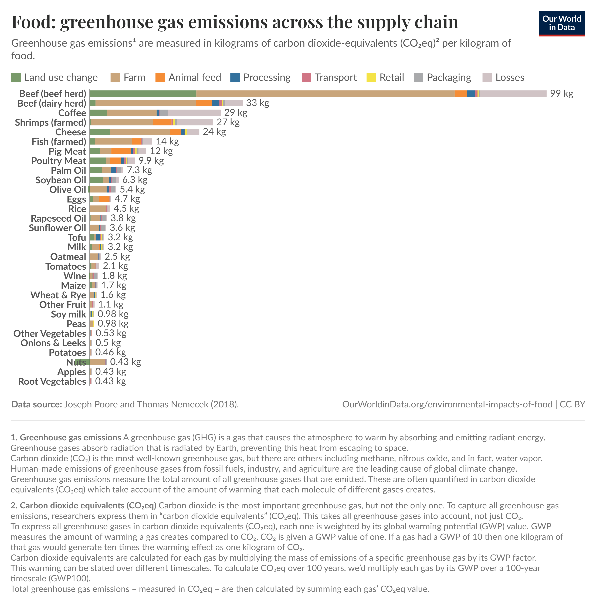

# Data Visualization

## Assignment 2: Good and Bad Data Visualization

### Requirements:

- Data visualizations are important tools for communication and convincing; we need to be able to evaluate the ways that data are presented in visual form to be critical consumers of information 
- To test your evaluation skills, locate two public data visualizations online, one good and one bad  
    - You can find data visualizations at https://public.tableau.com/app/discover or https://datavizproject.com/, or anywhere else you like! 
- For each visualization (good and bad):  
    - Explain (with reference to material covered up to date, along with readings and other scholarly sources, as needed) why you classified that visualization the way you did.
      ```
      The bad:
      ```

      
      ```
      This is the classic "Gun Deaths in Florida' chart which has been often toted as an example of bad data visualization, and is a great example of why we have data presentation standards.

      While the broad strokes of data source, axis names, etc are present, the flipped y-axis is an egregious addition. As discussed, our brains automatically assume that up = more, and having to interpret this graph upside down adds significantly to cognitive load, and overall goes against our instincts, especially because the rest of the graph is presented very typically. 
      
      Even though I've seen this graph multiple times, it is _still_ hard for me to grasp the actual data. The linear connection between the points do not help as well, with the author's intention being that it looks like dripping blood, inspired by another related (but better executed) graph based on the impact on deaths in Iraq by America. This is a 'rare' graph type, where no one presents data this way!

      Overall, I think this unfortunately falls into the category of 'very bad' for data visualization (not to say I don't understand the intention), but the message that people will get from a glance at the graph (since this is made for Reuters, likely scrolled past online or glanced at in an article), will be the exact opposite of what the data indicates. While the sources and information are more or less accurate, the way that is presented kneecaps this severely.
      ```
      ```
      How can it be improved?

      - The most simple solution would be to flip the y-axis, and move away from the 'dripping' visualization
      - If the orientation is to be kept, removing the typical layout, such as getting rid of the solid line, making the bars looks more 'blood'-like, highlight the reverse orientation
      - In general, either conforming to data presentation standards, or deviating further from them, would work, not this intermediate of typical layout yet counter-intuitive
      ```
      ```
      Resources:
      - https://medium.com/@nigelmills2000/the-truth-and-lies-behind-the-infamous-blood-graph-f6d6691c3626 (this is a great resource to read about this, and the author even makes a version trying to 'fix' some of the errors.)
      - Visualization GitHub slides
      - https://www.usna.edu/Users/cs/nchamber/courses/sd211/tbf/9.html
      ```
      ```
      The good:
      ```
      
      ```
      This is a graph generated from https://ourworldindata.org/, which is an online web portal that aggregates information about our world! This is just one facet of it, but there is an online tool which can be used to combine information and automatically visualize it. I think that this is a good visualization (apart from the fact that I maybe added too many types of food), because the data is:
      a) overall presented very clearly (e.g., you can tell which food during which stage of it's production emits GHGs). Unfortunately the embed is a static image, but on the website you can actually interact with each category to see the detailed breakdowns! Bars are to scale, and it is immediately obvious which foods have more impact, and why.
      b) everything is labelled - what the units are, what each of the colors mean, what kind of food (beef or dairy herds?) and overall is meticulous in this aspect.
      c) the data source and accuracy is highlighted, and the overall descriptions of what is considered GHGs, or CO2, are clearly described. It would be easy for readers to go and assess the data themselves and is not in any way obscured.
      ```
      ```
      How can it be improved?
      - overall while the figure is excellent, there are some minor points that I think can probably be refined. For example, having an overall 'x-axis', and maybe not displaying the total kg for every category might make it look cleaner (e.g., only display for the top 5 emitters)
      - I think some of the descriptions at the bottom can be moved to say, the figure caption, and can be simplified down to the essentials for understanding the figure.
      - (and this is on me, but choose less but more relevant foods to visualize!)
      ```
      ```
      Resources:
      - https://ourworldindata.org/explorers/food-footprints
      - Not the End of the World by Hannah Ritchie (I highly recommend this book in general!)
      - Data Science visualization slides
      ```


- Word count should not exceed (as a maximum) 500 words for each visualization (i.e. 
300 words for your good example and 500 for your bad example)

### Why am I doing this assignment?:

- This assignment ensures active participation in the course, and assesses the learning outcomes
* Apply general design principles to create accessible and equitable data visualizations
* Use data visualization to tell a story

### Rubric:

| Component               | Scoring   | Requirement                                                 |
|-------------------------|-----------|-------------------------------------------------------------|
| Data viz classification and justification | Complete/Incomplete | - Data viz are clearly classified as good or bad<br />- At least three reasons for each classification are provided<br />- Reasoning is supported by course content or scholarly sources |
| Suggested improvements  | Complete/Incomplete | - At least two suggestions for improvement<br />- Suggestions are supported by course content or scholarly sources |

## Submission Information

🚨 **Please review our [Assignment Submission Guide](https://github.com/UofT-DSI/onboarding/blob/main/onboarding_documents/submissions.md)** 🚨 for detailed instructions on how to format, branch, and submit your work. Following these guidelines is crucial for your submissions to be evaluated correctly.

### Submission Parameters:
* Submission Due Date: `23:59 - 10/26/2025`
* The branch name for your repo should be: `assignment-2`
* What to submit for this assignment:
    * This markdown file (assignment_2.md) should be populated and should be the only change in your pull request.
* What the pull request link should look like for this assignment: `https://github.com/<your_github_username>/visualization/pull/<pr_id>`
    * Open a private window in your browser. Copy and paste the link to your pull request into the address bar. Make sure you can see your pull request properly. This helps the technical facilitator and learning support staff review your submission easily.

Checklist:
- [ ] Create a branch called `assignment-2`.
- [ ] Ensure that the repository is public.
- [ ] Review [the PR description guidelines](https://github.com/UofT-DSI/onboarding/blob/main/onboarding_documents/submissions.md#guidelines-for-pull-request-descriptions) and adhere to them.
- [ ] Verify that the link is accessible in a private browser window.

If you encounter any difficulties or have questions, please don't hesitate to reach out to our team via our Slack. Our Technical Facilitators and Learning Support staff are here to help you navigate any challenges.
