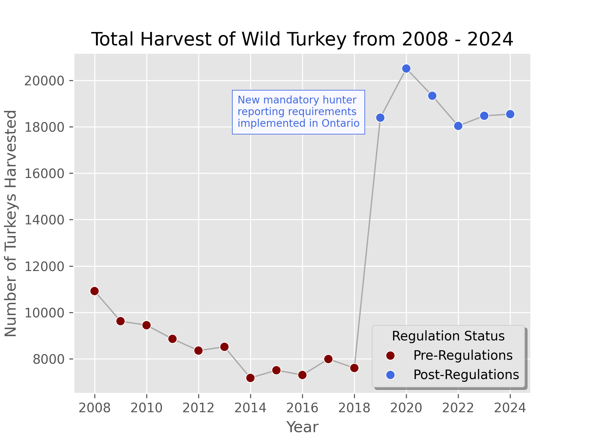

## Total Harvest of Wild Turkey from 2008 - 2024 in Ontario

> What software did you use to create your data visualization?

Here, I used Python and Seaborne, as well as matplotlib to visualize this graph.

> Who is your intended audience?

My intended audience for this graph is government officials and regulatory workers who may be interested in how well the new regulations are working in terms of counts for wild turkey, as part of a report or slide show summarizing change over time, and since uptake of the regulation.
    
> What information or message are you trying to convey with your visualization? 

I am trying to convey that the regulations have been effective in increasing the amount of reports of wild turkey harvests. This is would be presented in conjunction with population estimates, which have not changed significantly, indicating that the meteoric increase from 2018-2019 is likely due to the change in regulations [source](https://naturecounts.ca/nc/socb-epoc/species.jsp?sp=wiltur).

> What aspects of design did you consider when making your visualization? How did you apply them? With what elements of your plots? 

I considered the level of detail that needed to be shown, and overall easy-to-interpret visual language (such as adding the text box indicating when the changes in regulations happened, coloring the lines differently, having simple and well-labelled axes.)
    
> How did you ensure that your data visualizations are reproducible? If the tool you used to make your data visualization is not reproducible, how will this impact your data visualization? 

My visualization is reproducible thanks to the Ontario open data website, and time dated-access codes. There are no stochastic processes in my workflow.
    
> How did you ensure that your data visualization is accessible?

During the process, I made sure to keep the colors high-contrast, and used https://pilestone.com/pages/color-blindness-simulator to see if colors were still discernable with certain types of color blindness. I also added alt text in the description in this markdown file. In general text is kept large and simple.
    
> Who are the individuals and communities who might be impacted by your visualization?

Policy-makers, hunters, other people who are interested in policy impacts on data collection (such as other provinces).
    
> How did you choose which features of your chosen dataset to include or exclude from your visualization?

I set out with a simple goal of visualizing wild turkey harvesting reports over time, so it was easy to subset the data to the appropriate axes.
    
> What ‘underwater labour’ contributed to your final data visualization product?

Lots! Exploring the data, cleaning it up, using some 'hacks' to make it look the way I wanted to (e.g. plotting the line and markers separately). Understanding what changes were reflected in the change in data, interpreting WMUs, different approaches of what looked good and not... the list goes on!