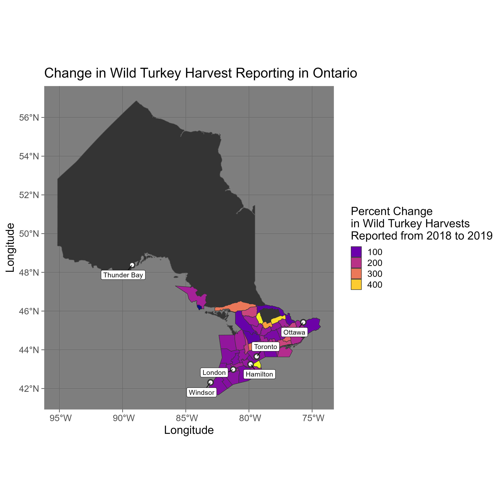

## Changes in wild turkey harvesting in wildlife management units in Ontario from 2018 to 2019

> What software did you use to create your data visualization?

I used R, within a Jupyter notebook to create this visualization.

> Who is your intended audience? 
Similar to visualization 1, this would be useful for policymakers and those that are interested in how changes in regulation can impact collected data, this time especially in smaller regions that might fall within certain WMUs.
    
> What information or message are you trying to convey with your visualization?
The main message is to convey that the change in regulations between 2018 and 2019 disproportionately impacted different WMUs.

> What aspects of design did you consider when making your visualization? How did you apply them? With what elements of your plots?
I have some experience in geographic data plotting, and I thought that this would be an interesting thought experiment. I wanted to keep the colors clear and continuous (using dark background plus viridis palettes). I also wanted to increase the interpretability of the plot by adding major cities and overall Ontario, as without the context it is not clear what the areas actually are.
    
> How did you ensure that your data visualizations are reproducible? If the tool you used to make your data visualization is not reproducible, how will this impact your data visualization?
Similar to visualization 1, I recorded dates and links for data access. There are no stochastic processes in these visualizations.
    
> How did you ensure that your data visualization is accessible?
I also tested the colors against colorblind simulators, as well as keeping font size large, some alt text, and overall readability was taken into consideration.
    
> Who are the individuals and communities who might be impacted by your visualization?
Perhaps policymakers may see that this was effective in changing reporting habits in these areas, and choose to implement this for their own regions. The areas in which there was a large change may be also impacted with additional scrutiny of data points, as reporting was previously likely not adequate to capture actual harvest numbers.
    
> How did you choose which features of your chosen dataset to include or exclude from your visualization?
This was a long process (see suppl. Jupyter notebook), and was decided after seeing multiple intermediate plots and noting the patterns there. I decided to use the regional and map data as I thought this would be an interesting angle of integrating multiple data types for visualization. 
    
> What ‘underwater labour’ contributed to your final data visualization product?
Again, lots! There were multiple intermediate plots and steps (suppl. Jupyter), looking for the ArcGIS data and geographical data was challenging, and setting up the R magic in Jupyter as well :). Getting access to the right sets of data, tinkering with colors and contrasts.